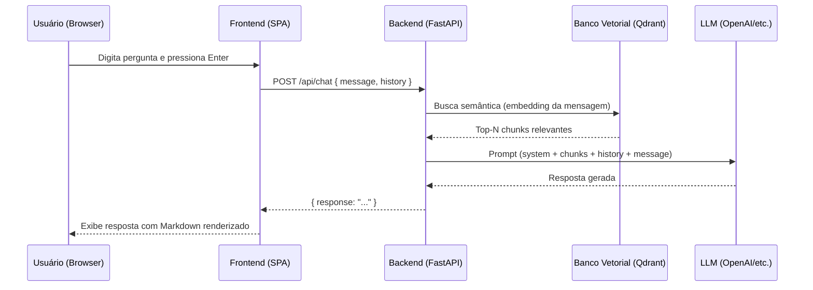
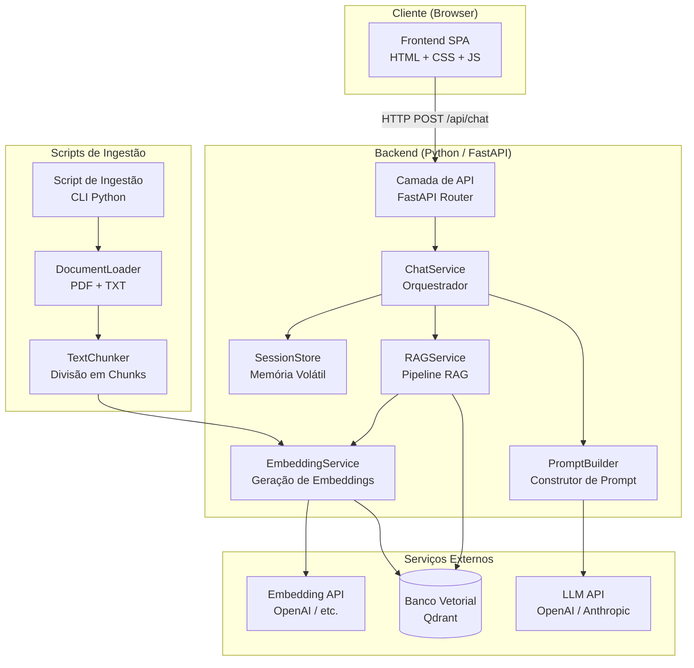

# Documento de Design Técnico

## Assistente de IA para Suporte do ERP Evol

---

## Visão Geral

O **Assistente de IA para Suporte do ERP Evol** é uma aplicação web conversacional que permite a usuários do ERP Evol obter orientações operacionais de forma rápida, sem necessidade de autenticação. A arquitetura é composta por três camadas principais:

1. **Frontend (SPA)**: Interface de chat estilo ChatGPT, com suporte a temas Claro/Escuro e renderização de Markdown.
2. **Backend (FastAPI)**: Orquestra o pipeline RAG, gerencia o contexto de sessão em memória volátil e expõe a API REST.
3. **Banco Vetorial (Qdrant)**: Armazena e serve embeddings da documentação do ERP Evol para busca semântica.

O sistema é **stateless em relação ao usuário**: nenhuma informação de sessão é persistida em banco de dados relacional. O histórico de conversa existe apenas na memória do processo do servidor durante a sessão ativa e no estado do cliente (frontend). Ao recarregar a página, a conversa é zerada.

### Fluxo de Alto Nível



---

## Arquitetura

### Visão Geral dos Componentes



### Decisões Arquiteturais

**1. Gerenciamento de Sessão em Memória**
O histórico de sessão é armazenado em um dicionário Python em memória (`SessionStore`), indexado por um `session_id` gerado no frontend e enviado em cada requisição. Isso elimina a necessidade de banco de dados relacional e garante que os dados sejam descartados quando o processo reinicia ou quando a sessão expira por TTL.

*Tradeoff*: Em ambientes com múltiplas instâncias do backend (horizontal scaling), sessões não são compartilhadas entre instâncias. Para o escopo atual (ferramenta interna, baixo volume), isso é aceitável. Se necessário no futuro, pode-se substituir o `SessionStore` por Redis sem alterar a interface.

**2. Pipeline RAG com Qdrant**
Qdrant foi escolhido como banco vetorial por ser open-source, ter suporte nativo a Docker, oferecer API REST e gRPC, e suportar filtragem por metadados. A alternativa PGVector foi descartada por exigir PostgreSQL, adicionando complexidade operacional desnecessária para o escopo atual.

**3. Separação entre EmbeddingService e RAGService**
O `EmbeddingService` é responsável exclusivamente pela geração de vetores (tanto no pipeline RAG quanto na ingestão). O `RAGService` orquestra a busca semântica. Essa separação permite trocar o modelo de embeddings sem alterar a lógica de busca.

**4. Frontend como SPA Estática**
O frontend é uma Single Page Application (SPA) servida como arquivos estáticos, sem framework pesado (React/Vue), para minimizar dependências e simplificar o deploy. O backend FastAPI pode servir os arquivos estáticos diretamente via `StaticFiles`.

---

## Componentes e Interfaces

### Backend

#### `ChatService`

Orquestra o fluxo completo de uma requisição de chat.

```python
class ChatService:
    def __init__(
        self,
        rag_service: RAGService,
        session_store: SessionStore,
        prompt_builder: PromptBuilder,
        llm_client: LLMClient,
    ): ...

    async def process_message(
        self,
        session_id: str,
        user_message: str,
        client_history: list[ChatMessage],
    ) -> ChatResponse: ...
```

#### `RAGService`

Executa a busca semântica no banco vetorial.

```python
class RAGService:
    def __init__(
        self,
        embedding_service: EmbeddingService,
        vector_db_client: VectorDBClient,
        top_k: int,
        similarity_threshold: float,
    ): ...

    async def retrieve_chunks(
        self,
        query: str,
    ) -> list[RetrievedChunk]: ...
```

#### `SessionStore`

Gerencia o histórico de sessões em memória volátil com TTL automático.

```python
class SessionStore:
    def __init__(self, ttl_seconds: int = 3600): ...

    def get_history(self, session_id: str) -> list[ChatMessage]: ...
    def append_message(self, session_id: str, message: ChatMessage) -> None: ...
    def clear_session(self, session_id: str) -> None: ...
    def truncate_to_token_limit(
        self,
        session_id: str,
        max_tokens: int,
        preserve_last: bool = True,
    ) -> None: ...
```

#### `PromptBuilder`

Constrói o prompt completo enviado ao LLM, incluindo o system prompt com restrições de escopo.

```python
class PromptBuilder:
    def build_system_prompt(self, retrieved_chunks: list[RetrievedChunk]) -> str: ...

    def build_messages(
        self,
        system_prompt: str,
        history: list[ChatMessage],
        user_message: str,
    ) -> list[dict]: ...
```

#### `EmbeddingService`

Gera embeddings de texto usando o modelo configurado.

```python
class EmbeddingService:
    def __init__(self, model: str, api_key: str): ...

    async def embed(self, text: str) -> list[float]: ...
    async def embed_batch(self, texts: list[str]) -> list[list[float]]: ...
```

#### `TextChunker`

Divide documentos em chunks com tamanho e overlap configuráveis.

```python
class TextChunker:
    def __init__(self, chunk_size: int, chunk_overlap: int): ...

    def chunk(self, text: str, metadata: ChunkMetadata) -> list[Chunk]: ...
```

### API Endpoints

| Método | Caminho | Descrição |
|--------|---------|-----------|
| `POST` | `/api/chat` | Envia mensagem e recebe resposta do assistente |
| `GET` | `/api/health` | Verificação de saúde do serviço |
| `GET` | `/docs` | Documentação interativa Swagger UI (automática) |
| `GET` | `/` | Serve o frontend SPA |

#### Schema: `POST /api/chat`

**Request Body:**
```json
{
  "session_id": "uuid-v4",
  "message": "Como emito uma nota fiscal de devolução?",
  "history": [
    { "role": "user", "content": "Olá" },
    { "role": "assistant", "content": "Olá! Como posso ajudar?" }
  ]
}
```

**Response (200 OK):**
```json
{
  "response": "Para emitir uma nota fiscal de devolução no Evol...",
  "sources": [
    { "filename": "manual_nfe.pdf", "page": 42 }
  ]
}
```

**Response (422 Unprocessable Entity):**
```json
{
  "detail": [
    { "loc": ["body", "message"], "msg": "field required", "type": "value_error.missing" }
  ]
}
```

### Frontend

O frontend é uma SPA com os seguintes módulos JavaScript:

| Módulo | Responsabilidade |
|--------|-----------------|
| `chat.js` | Gerencia o estado da conversa, envia requisições ao backend |
| `ui.js` | Manipula o DOM: renderiza mensagens, indicador de carregamento, erros |
| `theme.js` | Gerencia alternância de tema Claro/Escuro, detecta preferência do sistema |
| `markdown.js` | Renderiza Markdown nas respostas (usando `marked.js`) |
| `session.js` | Gera e persiste o `session_id` no `sessionStorage` do browser |

---

## Modelos de Dados

### Modelos do Backend (Pydantic)

```python
class ChatMessage(BaseModel):
    role: Literal["user", "assistant"]
    content: str

class ChatRequest(BaseModel):
    session_id: str
    message: str
    history: list[ChatMessage] = []

class SourceReference(BaseModel):
    filename: str
    page: int | None = None
    position: int | None = None

class ChatResponse(BaseModel):
    response: str
    sources: list[SourceReference] = []

class RetrievedChunk(BaseModel):
    content: str
    score: float
    metadata: SourceReference

class Chunk(BaseModel):
    content: str
    metadata: ChunkMetadata

class ChunkMetadata(BaseModel):
    filename: str
    page: int | None = None
    position: int
    chunk_index: int
```

### Estrutura no Banco Vetorial (Qdrant)

Cada ponto (point) armazenado no Qdrant possui:

| Campo | Tipo | Descrição |
|-------|------|-----------|
| `id` | UUID | Identificador único do chunk (derivado de hash do conteúdo) |
| `vector` | `float[]` | Embedding do chunk |
| `payload.content` | `string` | Texto do chunk |
| `payload.filename` | `string` | Nome do arquivo de origem |
| `payload.page` | `int?` | Número da página (para PDFs) |
| `payload.position` | `int` | Posição do chunk no documento |
| `payload.chunk_index` | `int` | Índice do chunk dentro do documento |

O ID do ponto é derivado de um hash SHA-256 do conteúdo do chunk, garantindo idempotência na ingestão: reinserir o mesmo chunk sobrescreve o ponto existente (upsert).

### Configuração (Variáveis de Ambiente)

| Variável | Obrigatória | Padrão | Descrição |
|----------|-------------|--------|-----------|
| `QDRANT_URL` | Sim | — | URL do servidor Qdrant |
| `QDRANT_API_KEY` | Não | — | Chave de API do Qdrant (se autenticado) |
| `QDRANT_COLLECTION` | Não | `evol_docs` | Nome da coleção no Qdrant |
| `LLM_API_KEY` | Sim | — | Chave de API do provedor LLM |
| `LLM_MODEL` | Sim | — | Identificador do modelo LLM (ex.: `gpt-4o`) |
| `EMBEDDING_MODEL` | Sim | — | Identificador do modelo de embeddings |
| `RAG_TOP_K` | Não | `5` | Número de chunks recuperados por busca |
| `RAG_SIMILARITY_THRESHOLD` | Não | `0.7` | Limiar mínimo de similaridade semântica |
| `CORS_ALLOWED_ORIGINS` | Sim | — | Origens permitidas para CORS (separadas por vírgula) |
| `SESSION_TTL_SECONDS` | Não | `3600` | TTL das sessões em memória (segundos) |
| `CHUNK_SIZE` | Não | `512` | Tamanho máximo de cada chunk (em tokens) |
| `CHUNK_OVERLAP` | Não | `64` | Sobreposição entre chunks consecutivos (em tokens) |

---

## Propriedades de Corretude

*Uma propriedade é uma característica ou comportamento que deve ser verdadeiro em todas as execuções válidas de um sistema — essencialmente, uma declaração formal sobre o que o sistema deve fazer. Propriedades servem como ponte entre especificações legíveis por humanos e garantias de corretude verificáveis por máquinas.*

### Propriedade 1: Ordenação cronológica do histórico de mensagens

*Para qualquer* sequência de mensagens enviadas durante uma sessão, a ordem de exibição na interface deve preservar exatamente a ordem de inserção (do mais antigo ao mais recente), sem inversões ou omissões.

**Valida: Requisito 1.5**

---

### Propriedade 2: Persistência de tema durante interações

*Para qualquer* tema selecionado pelo usuário e qualquer sequência de interações subsequentes (envio de mensagens, recebimento de respostas), o tema ativo deve permanecer inalterado ao longo de toda a sessão.

**Valida: Requisito 2.3**

---

### Propriedade 3: Renderização de Markdown

*Para qualquer* string de resposta contendo elementos Markdown válidos (negrito, itálico, listas ordenadas, listas não ordenadas, blocos de código), a função de renderização deve produzir HTML correspondente que contenha os elementos esperados para cada marcação presente.

**Valida: Requisito 3.2**

---

### Propriedade 4: Rejeição de mensagens vazias ou somente espaços

*Para qualquer* string composta exclusivamente de caracteres de espaço em branco (espaços, tabs, quebras de linha), a tentativa de envio deve ser rejeitada pelo frontend sem disparar nenhuma requisição HTTP ao backend, e o estado da conversa deve permanecer inalterado.

**Valida: Requisito 3.3**

---

### Propriedade 5: Inclusão completa do histórico na requisição ao LLM

*Para qualquer* histórico de sessão com N mensagens (onde N está abaixo do limite de tokens), o payload enviado ao LLM deve conter exatamente todas as N mensagens do histórico, na mesma ordem, sem omissões ou duplicações.

**Valida: Requisito 4.1**

---

### Propriedade 6: Descarte do histórico ao encerrar sessão

*Para qualquer* sessão com histórico não vazio, após o encerramento da sessão (chamada a `clear_session`), qualquer tentativa de recuperar o histórico daquela sessão deve retornar uma lista vazia.

**Valida: Requisito 4.3**

---

### Propriedade 7: Truncamento preserva a mensagem mais recente

*Para qualquer* histórico de sessão que exceda o limite de tokens configurado, após o truncamento, a última mensagem do usuário deve estar presente no histórico resultante, e o número total de tokens do histórico truncado deve ser menor ou igual ao limite configurado.

**Valida: Requisito 4.4**

---

### Propriedade 8: Seleção de exatamente N chunks relevantes

*Para qualquer* resultado de busca semântica com M chunks disponíveis acima do limiar de similaridade, o `RAGService` deve selecionar `min(M, N)` chunks, onde N é o valor configurado em `RAG_TOP_K`, sem duplicatas e ordenados por score decrescente.

**Valida: Requisito 5.2**

---

### Propriedade 9: Fallback quando similaridade abaixo do limiar

*Para qualquer* consulta cuja busca semântica retorne apenas chunks com score abaixo do limiar configurado (`RAG_SIMILARITY_THRESHOLD`), o `RAGService` deve retornar uma lista vazia de chunks, e o `ChatService` deve incluir no prompt ao LLM a instrução de informar ao usuário que não foram encontradas informações relevantes na base de conhecimento.

**Valida: Requisito 5.4**

---

### Propriedade 10: Chunking respeita tamanho e overlap configurados

*Para qualquer* texto de entrada e configuração de `chunk_size` e `chunk_overlap`, todos os chunks gerados pelo `TextChunker` devem ter comprimento menor ou igual a `chunk_size`, e para quaisquer dois chunks consecutivos, os últimos `chunk_overlap` tokens do chunk anterior devem aparecer no início do chunk seguinte.

**Valida: Requisito 6.2**

---

### Propriedade 11: Resiliência do script de ingestão a arquivos inválidos

*Para qualquer* conjunto de arquivos de entrada contendo K arquivos válidos e J arquivos inválidos (ilegíveis ou em formato não suportado), o script de ingestão deve processar com sucesso todos os K arquivos válidos, registrar exatamente J erros em log (um por arquivo inválido), e o relatório final deve refletir exatamente essas contagens.

**Valida: Requisitos 6.4, 6.5**

---

### Propriedade 12: Idempotência da ingestão

*Para qualquer* conjunto de arquivos de documentação, executar o script de ingestão N vezes (N ≥ 2) com os mesmos arquivos deve produzir exatamente o mesmo número de chunks no banco vetorial que uma única execução — sem duplicatas acumuladas a cada execução.

**Valida: Requisito 6.6**

---

### Propriedade 13: Contrato de API — aceitação de payloads válidos

*Para qualquer* payload de requisição ao endpoint `POST /api/chat` que contenha um `session_id` não vazio, um `message` não vazio e um `history` com mensagens bem formadas, a API deve retornar HTTP 200 com um corpo JSON contendo o campo `response`.

**Valida: Requisitos 7.1, 7.2**

---

### Propriedade 14: Rejeição de payloads inválidos com HTTP 422

*Para qualquer* payload de requisição ao endpoint `POST /api/chat` que esteja malformado (campo obrigatório ausente, tipo incorreto ou JSON inválido), a API deve retornar HTTP 422 com um corpo JSON descrevendo os campos inválidos.

**Valida: Requisito 7.3**

---

### Propriedade 15: Aplicação de CORS por origem

*Para qualquer* lista de origens configuradas em `CORS_ALLOWED_ORIGINS` e qualquer origem de requisição, a API deve aceitar requisições cross-origin apenas das origens presentes na lista configurada e rejeitar todas as demais com o comportamento padrão de CORS (ausência do header `Access-Control-Allow-Origin`).

**Valida: Requisito 7.6**

---

### Propriedade 16: System prompt contém instrução de restrição de escopo

*Para qualquer* construção do prompt do sistema pelo `PromptBuilder`, o texto resultante deve conter a instrução explícita que proíbe o LLM de simular execução de ações no ERP Evol, independentemente dos chunks recuperados ou do histórico da sessão.

**Valida: Requisitos 8.1, 8.3**

---

### Propriedade 17: Falha na inicialização com variáveis obrigatórias ausentes

*Para qualquer* subconjunto não vazio de variáveis de ambiente obrigatórias ausentes na inicialização do serviço, o processo deve encerrar com código de saída diferente de zero e o log de inicialização deve listar todas as variáveis ausentes.

**Valida: Requisito 9.2**

---

## Tratamento de Erros

### Erros do Backend

| Situação | Comportamento | Código HTTP |
|----------|--------------|-------------|
| Payload malformado ou campos ausentes | Retorna 422 com descrição dos campos inválidos (automático pelo FastAPI/Pydantic) | 422 |
| Falha na busca semântica (Qdrant indisponível) | Retorna 503 com mensagem de erro; loga o erro com stack trace | 503 |
| Falha na chamada ao LLM (timeout, erro de API) | Retorna 502 com mensagem de erro; loga o erro com stack trace | 502 |
| Nenhum chunk acima do limiar de similaridade | Retorna 200 com resposta informando ausência de informações relevantes | 200 |
| Variável de ambiente obrigatória ausente | Encerra o processo na inicialização com código de saída 1; loga as variáveis ausentes | — |

### Erros do Frontend

| Situação | Comportamento |
|----------|--------------|
| Resposta HTTP 4xx/5xx do backend | Exibe mensagem de erro amigável na área de conversa; mantém o campo de entrada ativo |
| Timeout de rede | Exibe mensagem de erro com sugestão de tentar novamente |
| Tentativa de envio com campo vazio | Ignora silenciosamente; não envia requisição |

### Erros do Script de Ingestão

| Situação | Comportamento |
|----------|--------------|
| Arquivo ilegível ou corrompido | Registra erro em log com nome do arquivo e descrição; continua processamento |
| Formato de arquivo não suportado | Registra aviso em log; pula o arquivo |
| Falha na conexão com Qdrant | Encerra o script com código de saída 1; loga o erro |
| Falha na geração de embedding | Registra erro em log para o chunk afetado; continua com os demais |

---

## Estratégia de Testes

### Abordagem Dual

A estratégia combina **testes baseados em exemplos** (para comportamentos específicos e casos de borda) com **testes baseados em propriedades** (para verificar invariantes universais). Ambos são complementares e necessários para cobertura abrangente.

### Testes Unitários (Exemplos)

Focados em comportamentos específicos e pontos de integração entre componentes:

- `PromptBuilder`: verificar que o system prompt contém a instrução de restrição de escopo; verificar que chunks são incluídos no contexto.
- `SessionStore`: verificar comportamento de TTL; verificar que sessão inexistente retorna lista vazia.
- `TextChunker`: verificar chunking de texto vazio; verificar chunking de texto menor que `chunk_size`.
- `ChatService`: verificar comportamento quando RAG retorna lista vazia; verificar tratamento de erro do LLM.
- `API Endpoints`: verificar health check; verificar resposta 422 para payload ausente.

### Testes Baseados em Propriedades (PBT)

Biblioteca: **[Hypothesis](https://hypothesis.readthedocs.io/)** (Python).

Cada teste de propriedade deve ser configurado com no mínimo **100 iterações** (`@settings(max_examples=100)`).

Cada teste deve ser anotado com um comentário referenciando a propriedade do design:

```python
# Feature: evol-erp-ai-assistant, Property N: <texto da propriedade>
```

**Propriedades a implementar como testes PBT:**

| Propriedade | Componente | Estratégia Hypothesis |
|-------------|-----------|----------------------|
| P1: Ordenação cronológica do histórico | `SessionStore` / UI | `st.lists(chat_message_strategy())` |
| P3: Renderização de Markdown | `markdown.js` / função de render | `st.text()` com elementos Markdown |
| P4: Rejeição de mensagens vazias | Frontend / validação | `st.text(alphabet=st.characters(whitespace=True))` |
| P5: Inclusão completa do histórico | `ChatService` | `st.lists(chat_message_strategy(), max_size=50)` |
| P6: Descarte do histórico ao encerrar sessão | `SessionStore` | `st.uuids()` + `st.lists(chat_message_strategy())` |
| P7: Truncamento preserva mensagem mais recente | `SessionStore` | `st.lists(chat_message_strategy(), min_size=1)` |
| P8: Seleção de N chunks relevantes | `RAGService` (com mock do Qdrant) | `st.lists(chunk_strategy(), min_size=0)` |
| P9: Fallback quando similaridade abaixo do limiar | `RAGService` (com mock) | `st.floats(min_value=0.0, max_value=threshold)` |
| P10: Chunking respeita tamanho e overlap | `TextChunker` | `st.text(min_size=1)` + `st.integers()` |
| P11: Resiliência a arquivos inválidos | Script de ingestão (com mock do Qdrant) | `st.lists(file_strategy())` |
| P12: Idempotência da ingestão | Script de ingestão (com mock do Qdrant) | `st.lists(document_strategy())` |
| P13: Aceitação de payloads válidos | API (TestClient FastAPI) | `st.builds(ChatRequest, ...)` |
| P14: Rejeição de payloads inválidos | API (TestClient FastAPI) | `st.fixed_dictionaries({...})` com campos ausentes |
| P15: Aplicação de CORS | API (TestClient FastAPI) | `st.lists(st.from_regex(url_pattern))` |
| P16: System prompt com restrição de escopo | `PromptBuilder` | `st.lists(chunk_strategy())` |
| P17: Falha na inicialização com variáveis ausentes | Módulo de configuração | `st.sets(st.sampled_from(REQUIRED_VARS))` |

### Testes de Integração

- Verificar que o pipeline RAG completo (busca + geração) responde em menos de 15 segundos (Requisito 5.5).
- Verificar que o endpoint de chat retorna resposta coerente com um Qdrant real e um LLM real (smoke test de ponta a ponta).
- Verificar que o script de ingestão popula o Qdrant corretamente com metadados de origem.

### Estrutura de Diretórios de Testes

```
backend/
├── tests/
│   ├── unit/
│   │   ├── test_prompt_builder.py
│   │   ├── test_session_store.py
│   │   ├── test_text_chunker.py
│   │   ├── test_rag_service.py
│   │   └── test_chat_service.py
│   ├── property/
│   │   ├── test_session_properties.py
│   │   ├── test_chunker_properties.py
│   │   ├── test_rag_properties.py
│   │   ├── test_api_properties.py
│   │   └── test_ingest_properties.py
│   └── integration/
│       ├── test_api_integration.py
│       └── test_ingest_integration.py
```
