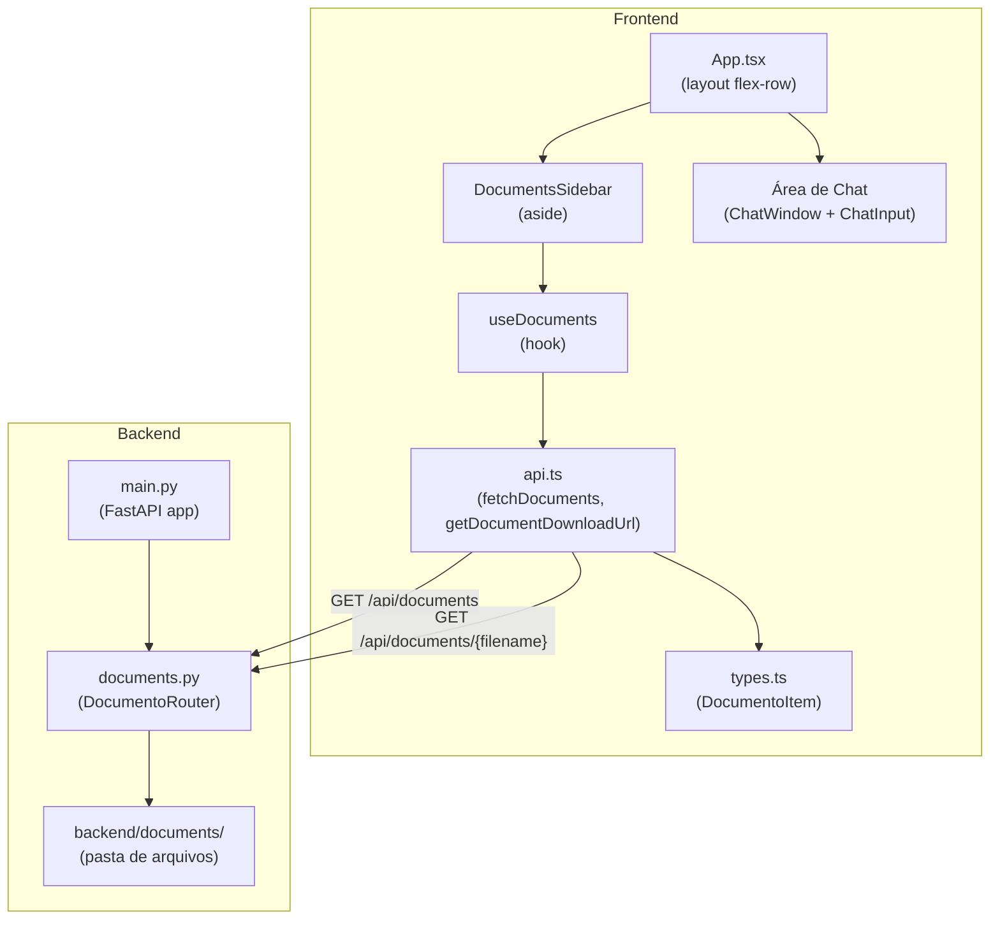
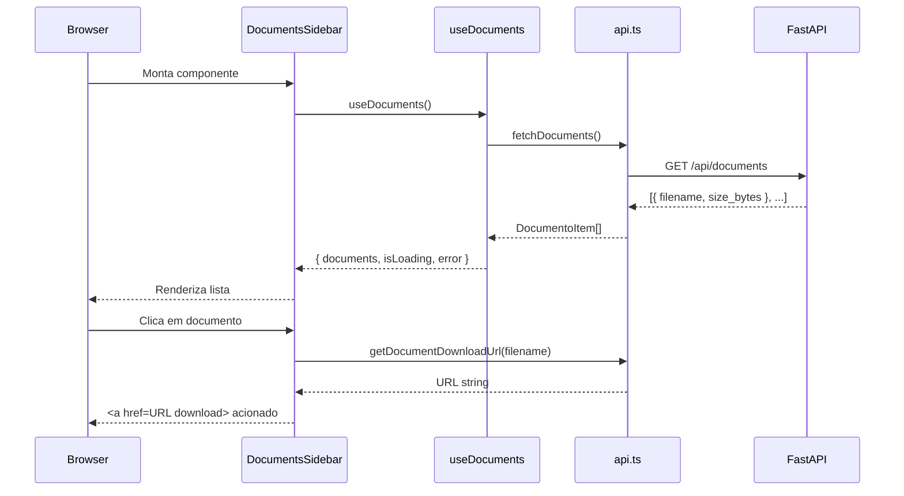

# Documento de Design — Painel de Documentos

## Visão Geral

A feature **Painel de Documentos** adiciona uma sidebar lateral esquerda à interface do Assistente de IA do ERP Evol, exibindo a lista de arquivos disponíveis na pasta `backend/documents/` e permitindo o download direto pelo navegador.

A implementação envolve dois lados:

- **Backend (FastAPI):** novo router `documents.py` com dois endpoints REST (`GET /api/documents` e `GET /api/documents/{filename}`), proteção contra path traversal e detecção automática de MIME type.
- **Frontend (React + TypeScript):** novo tipo `DocumentoItem`, funções de serviço, hook `useDocuments`, componente `DocumentsSidebar` e atualização do layout em `App.tsx`.

A direção estética segue o padrão já estabelecido no projeto: **Modern Corporate Minimalist**, paleta indigo/gray, dark mode via classe `dark` no `<html>`, e componentes estritamente tipados em TypeScript.

---

## Arquitetura

### Diagrama de Componentes



### Fluxo de Dados



---

## Componentes e Interfaces

### Backend

#### `backend/app/routers/documents.py`

```python
router = APIRouter()

@router.get("/documents", response_model=DocumentoListResponse)
async def list_documents() -> DocumentoListResponse:
    """Lista todos os arquivos regulares em backend/documents/, ordenados alfabeticamente."""

@router.get("/documents/{filename}")
async def download_document(filename: str) -> FileResponse:
    """Serve o arquivo para download com Content-Disposition: attachment."""
```

**Proteção contra path traversal:**
- Verificar se `filename` contém `../` ou `..\` → retornar HTTP 400
- Resolver o caminho absoluto com `Path(DOCUMENTS_DIR / filename).resolve()`
- Verificar se o caminho resolvido começa com `DOCUMENTS_DIR.resolve()` → caso contrário, HTTP 400

**Detecção de MIME:**
- Usar `mimetypes.guess_type(filename)` da stdlib Python
- Fallback: `application/octet-stream`

#### Modelos Pydantic (`backend/app/models.py` ou inline no router)

```python
class DocumentoItem(BaseModel):
    filename: str
    size_bytes: int

class DocumentoListResponse(BaseModel):
    documents: list[DocumentoItem]
```

#### Registro em `backend/app/main.py`

```python
from app.routers import chat, documents, health

app.include_router(documents.router, prefix="/api")
```

#### Pasta de documentos

- Criar `backend/documents/.gitkeep` para versionar a pasta vazia no Git.
- O caminho da pasta é resolvido relativamente ao arquivo `documents.py` usando `Path(__file__).parent.parent.parent / "documents"`.

---

### Frontend

#### `src/types.ts` — Novo tipo

```typescript
export type DocumentoItem = {
  filename: string;
  size_bytes: number;
};

export type DocumentoListResponse = {
  documents: DocumentoItem[];
};
```

#### `src/services/api.ts` — Novas funções

```typescript
export async function fetchDocuments(): Promise<DocumentoItem[]> {
  const response = await fetch(`${API_BASE_URL}/api/documents`);
  if (!response.ok) {
    throw new Error(`Erro ao buscar documentos: ${response.status}`);
  }
  const data = await response.json() as DocumentoListResponse;
  return data.documents;
}

export function getDocumentDownloadUrl(filename: string): string {
  return `${API_BASE_URL}/api/documents/${encodeURIComponent(filename)}`;
}
```

#### `src/hooks/useDocuments.ts`

```typescript
interface UseDocumentsResult {
  documents: DocumentoItem[];
  isLoading: boolean;
  error: string | null;
  refetch: () => void;
}

export function useDocuments(): UseDocumentsResult
```

**Comportamento:**
- Chama `fetchDocuments()` no mount e a cada chamada de `refetch()`
- Estado inicial: `isLoading: true`, `documents: []`, `error: null`
- Em caso de sucesso: `isLoading: false`, `documents: [...]`, `error: null`
- Em caso de erro: `isLoading: false`, `documents: []`, `error: mensagem`
- Usa `useCallback` para estabilizar `refetch`

#### `src/components/DocumentsSidebar.tsx`

```typescript
interface DocumentsSidebarProps {
  // sem props externas — usa useDocuments internamente
}

export default function DocumentsSidebar(): JSX.Element
```

**Estrutura do componente:**

```tsx
<aside
  aria-label="Painel de documentos"
  className="w-64 flex-shrink-0 flex flex-col border-r ..."
>
  <header>
    {/* Ícone + título "Documentos" */}
  </header>

  {/* Estado: carregando */}
  {isLoading && <SkeletonList />}

  {/* Estado: erro */}
  {error && <ErrorState message={error} onRetry={refetch} />}

  {/* Estado: vazio */}
  {!isLoading && !error && documents.length === 0 && <EmptyState />}

  {/* Estado: lista */}
  {!isLoading && !error && documents.length > 0 && (
    <ul role="list">
      {documents.map(doc => (
        <DocumentItem key={doc.filename} item={doc} />
      ))}
    </ul>
  )}
</aside>
```

**Subcomponente `DocumentItem`:**

```tsx
<li>
  <a
    href={getDocumentDownloadUrl(item.filename)}
    download={item.filename}
    aria-label={`Baixar ${item.filename}`}
    className="..."
  >
    <FileIcon />
    <span className="filename">{item.filename}</span>
    <span className="size">{formatFileSize(item.size_bytes)}</span>
  </a>
</li>
```

**Função utilitária `formatFileSize(bytes: number): string`:**
- `< 1024` → `"X B"`
- `< 1024 * 1024` → `"X,X KB"` (1 casa decimal)
- `>= 1024 * 1024` → `"X,X MB"` (1 casa decimal)
- Usa `toLocaleString('pt-BR')` para separador decimal vírgula

#### `src/App.tsx` — Atualização de layout

```tsx
export default function App() {
  return (
    <div className="flex flex-col h-screen bg-gray-50 dark:bg-gray-950 transition-colors">
      <Header theme={theme} onToggleTheme={toggleTheme} />
      <div className="flex flex-row flex-1 overflow-hidden">
        <DocumentsSidebar />
        <main className="flex flex-col flex-1 overflow-hidden">
          <ChatWindow messages={messages} isLoading={isLoading} />
          <ChatInput onSend={sendMessage} isLoading={isLoading} />
        </main>
      </div>
    </div>
  );
}
```

---

## Modelos de Dados

### Backend — Pydantic

| Campo | Tipo Python | Descrição |
|---|---|---|
| `DocumentoItem.filename` | `str` | Nome do arquivo (sem caminho) |
| `DocumentoItem.size_bytes` | `int` | Tamanho em bytes |
| `DocumentoListResponse.documents` | `list[DocumentoItem]` | Lista ordenada alfabeticamente |

### Frontend — TypeScript

| Tipo | Campos | Descrição |
|---|---|---|
| `DocumentoItem` | `filename: string`, `size_bytes: number` | Item de documento |
| `DocumentoListResponse` | `documents: DocumentoItem[]` | Resposta da API de listagem |

### Paleta de Cores da Sidebar

| Token | Light | Dark | Uso |
|---|---|---|---|
| Fundo sidebar | `white` | `gray-900` | Background do painel |
| Borda direita | `gray-200` | `gray-700` | Separador sidebar/chat |
| Texto principal | `gray-900` | `gray-100` | Filenames |
| Texto secundário | `gray-500` | `gray-400` | Tamanho do arquivo |
| Hover item | `gray-50` | `gray-800` | Fundo ao passar o mouse |
| Ícone | `indigo-500` | `indigo-400` | Ícone de arquivo |
| Título seção | `gray-700` | `gray-300` | "Documentos" |

---

## Propriedades de Correção

*Uma propriedade é uma característica ou comportamento que deve ser verdadeiro em todas as execuções válidas de um sistema — essencialmente, uma declaração formal sobre o que o sistema deve fazer. As propriedades servem como ponte entre especificações legíveis por humanos e garantias de correção verificáveis por máquina.*

### Reflexão sobre Redundância

Após análise do prework:

- **P1 (integridade dos itens)** e **P3 (ordenação alfabética)** são independentes — P1 verifica campos, P3 verifica ordem.
- **P2 (subdiretórios ignorados)** é independente das demais — verifica filtragem de tipo de entrada.
- **P4 (path traversal → 400)** e **P5 (filename inexistente → 404)** são independentes — testam inputs inválidos diferentes.
- **P6 (Content-Disposition)** e **P7 (MIME type)** são independentes — testam cabeçalhos diferentes.
- **P8 (formatFileSize)** e **P9 (getDocumentDownloadUrl)** são independentes — testam funções diferentes.
- **P10 (fetchDocuments lança Error em não-2xx)** é independente das demais.
- **P11 (filenames na UI)** pode ser combinada com P1 — ambas verificam integridade dos dados de DocumentoItem. Mantidas separadas pois P1 é backend e P11 é frontend.

Nenhuma redundância identificada. Todas as propriedades fornecem valor único de validação.

---

### Propriedade 1: Integridade dos itens retornados pela API

*Para qualquer* conjunto de arquivos regulares presentes na pasta `backend/documents/`, todos os `DocumentoItem` retornados pelo endpoint `GET /api/documents` devem ter `filename` não-vazio e `size_bytes >= 0`.

**Validates: Requirements 1.2**

---

### Propriedade 2: Subdiretórios são ignorados na listagem

*Para qualquer* estrutura de diretório contendo arquivos regulares e subdiretórios dentro de `backend/documents/`, nenhum subdiretório deve aparecer como item na resposta de `GET /api/documents`.

**Validates: Requirements 1.5**

---

### Propriedade 3: Listagem retorna itens em ordem alfabética

*Para qualquer* conjunto de arquivos na pasta `backend/documents/`, a lista retornada pelo endpoint `GET /api/documents` deve estar ordenada alfabeticamente pelo campo `filename` (ordem crescente, case-sensitive conforme o sistema de arquivos).

**Validates: Requirements 1.6**

---

### Propriedade 4: Path traversal sempre retorna HTTP 400

*Para qualquer* string de `filename` que contenha a sequência `../` ou `..\`, o endpoint `GET /api/documents/{filename}` deve retornar HTTP 400, sem acessar o sistema de arquivos fora da pasta de documentos.

**Validates: Requirements 2.4**

---

### Propriedade 5: Filename inexistente sempre retorna HTTP 404

*Para qualquer* string de `filename` que não corresponda a um arquivo existente na pasta `backend/documents/` (e que não contenha path traversal), o endpoint `GET /api/documents/{filename}` deve retornar HTTP 404.

**Validates: Requirements 2.3**

---

### Propriedade 6: Content-Disposition contém o filename correto

*Para qualquer* `filename` válido existente na pasta `backend/documents/`, a resposta do endpoint `GET /api/documents/{filename}` deve incluir o cabeçalho `Content-Disposition: attachment; filename="{filename}"` com o nome exato do arquivo.

**Validates: Requirements 2.2**

---

### Propriedade 7: MIME type é detectado corretamente por extensão

*Para qualquer* extensão de arquivo conhecida pelo módulo `mimetypes` da stdlib Python, o cabeçalho `Content-Type` da resposta de download deve corresponder ao MIME type esperado para aquela extensão.

**Validates: Requirements 2.5**

---

### Propriedade 8: formatFileSize produz string legível para qualquer size_bytes

*Para qualquer* valor inteiro `size_bytes >= 0`, a função `formatFileSize` deve retornar uma string não-vazia contendo um número seguido de uma unidade de medida (`B`, `KB` ou `MB`).

**Validates: Requirements 5.6**

---

### Propriedade 9: getDocumentDownloadUrl sempre retorna URL válida com filename no path

*Para qualquer* string `filename` não-vazia, a função `getDocumentDownloadUrl(filename)` deve retornar uma string que começa com a base URL da API e contém o `filename` (URL-encoded) no path.

**Validates: Requirements 6.3, 7.2**

---

### Propriedade 10: fetchDocuments lança Error para qualquer status HTTP não-2xx

*Para qualquer* status HTTP no intervalo 400–599, a função `fetchDocuments()` deve lançar um `Error` com mensagem descritiva, sem retornar dados parciais.

**Validates: Requirements 7.4**

---

## Tratamento de Erros

### Backend

| Situação | Comportamento |
|---|---|
| Pasta `backend/documents/` não existe | Retorna `{ documents: [] }` com HTTP 200 |
| Pasta vazia | Retorna `{ documents: [] }` com HTTP 200 |
| `filename` com `../` ou `..\` | HTTP 400: `"Nome de arquivo inválido: contém sequência de travessia de diretório"` |
| `filename` não encontrado | HTTP 404: `"Arquivo não encontrado: {filename}"` |
| Erro de leitura do arquivo (permissão, etc.) | HTTP 500: `"Erro interno ao ler o arquivo"` |

### Frontend

| Situação | Comportamento |
|---|---|
| Erro de rede em `fetchDocuments` | Exibe mensagem de erro + botão "Tentar novamente" na sidebar |
| HTTP não-2xx em `fetchDocuments` | Exibe mensagem de erro + botão "Tentar novamente" na sidebar |
| Lista vazia | Exibe mensagem "Nenhum documento disponível" |
| Erro de download (404) | Exibe mensagem "Arquivo não encontrado" |
| Erro de download (outro) | Exibe mensagem "Erro ao baixar o arquivo. Tente novamente." |

---

## Estratégia de Testes

### Abordagem Dual

A estratégia combina testes unitários com exemplos concretos e testes baseados em propriedades (PBT) para cobertura abrangente.

### Backend — Testes de Propriedade (Hypothesis)

A biblioteca escolhida é **Hypothesis** (já presente em `pyproject.toml` como dependência de dev).

Cada teste de propriedade deve rodar com mínimo de 100 iterações (padrão do Hypothesis).

**Arquivo:** `backend/tests/property/test_documents_properties.py`

| Propriedade | Estratégia de Geração | O que verificar |
|---|---|---|
| P1 — Integridade dos itens | `st.lists(st.filenames())` com mock do filesystem | `item.filename != ""` e `item.size_bytes >= 0` para todos os itens |
| P2 — Subdiretórios ignorados | `st.lists(st.filenames())` + subdiretórios aleatórios | Nenhum item na resposta é um diretório |
| P3 — Ordem alfabética | `st.lists(st.filenames(), min_size=1)` | `documents == sorted(documents, key=lambda x: x.filename)` |
| P4 — Path traversal → 400 | `st.text()` com `../` ou `..\` inserido | Status code == 400 |
| P5 — Filename inexistente → 404 | `st.text(alphabet=st.characters(whitelist_categories=('L',)))` | Status code == 404 |
| P6 — Content-Disposition | `st.filenames()` com arquivo mockado | Header contém `attachment; filename="{filename}"` |
| P7 — MIME type | `st.sampled_from([".pdf", ".docx", ".xlsx", ".txt", ".png"])` | Content-Type corresponde ao MIME esperado |

**Tag format:** `# Feature: documents-panel, Property {N}: {texto}`

### Backend — Testes Unitários com Exemplos

**Arquivo:** `backend/tests/unit/test_documents.py`

- Pasta vazia → retorna lista vazia com HTTP 200
- Pasta inexistente → retorna lista vazia com HTTP 200
- Arquivo existente → retorna conteúdo com Content-Disposition correto
- Registro do router em `main.py` → endpoints acessíveis sob `/api`

### Frontend — Testes de Propriedade (fast-check)

A biblioteca escolhida é **fast-check** (a instalar como devDependency).

**Arquivo:** `frontend/src/services/__tests__/api.test.ts`

| Propriedade | Estratégia de Geração | O que verificar |
|---|---|---|
| P8 — formatFileSize | `fc.integer({ min: 0, max: 10_000_000_000 })` | String não-vazia com unidade |
| P9 — getDocumentDownloadUrl | `fc.string({ minLength: 1 })` | URL começa com base URL e contém filename encoded |
| P10 — fetchDocuments lança Error | `fc.integer({ min: 400, max: 599 })` | `await expect(fetchDocuments()).rejects.toThrow()` |

**Tag format:** `// Feature: documents-panel, Property {N}: {texto}`

### Frontend — Testes Unitários com Exemplos

**Arquivo:** `frontend/src/components/__tests__/DocumentsSidebar.test.tsx`

- Renderiza skeleton durante carregamento
- Renderiza lista de documentos após carregamento
- Renderiza mensagem de estado vazio
- Renderiza mensagem de erro + botão retry
- Botão retry chama `refetch`
- Elemento `aside` tem `aria-label="Painel de documentos"`
- Links de download têm `aria-label` descritivo

### Configuração de Testes Frontend

Para executar os testes frontend, instalar:
```bash
npm install --save-dev vitest @testing-library/react @testing-library/jest-dom jsdom fast-check
```

Adicionar ao `package.json`:
```json
"scripts": {
  "test": "vitest --run"
}
```
